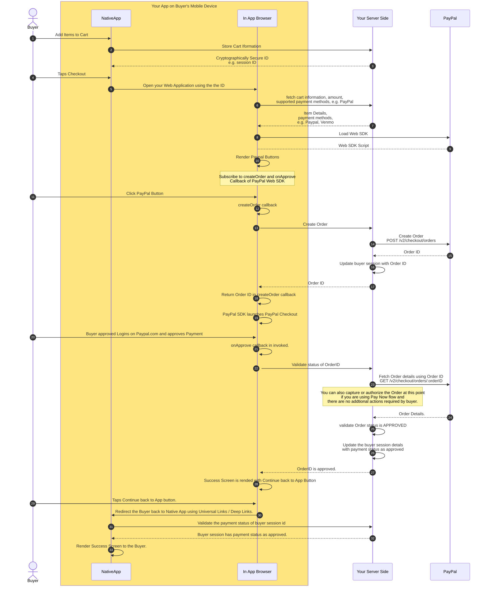

# mobile-app-web-sdk-integration-example

This Mono Repo contains three applications to demostrate examples of using PayPal Web SDK in your Native Mobile Applications. 
1. A Web Application which should be hosted on your Web Server
2. A Sample Android Application using Java to show an example of using the above Web Application in your Android Application.
3. A Sample iOS Application using SwiftUI to show an example of using the above Web Application in your iOS Application.

------------------------------------------------------

> **Important:** PayPal does not recommend using Webview to integrate PayPal Checkout with Native Mobile App. To deliver the best experience use [PayPal Android SDK](https://developer.paypal.com/docs/checkout/advanced/android/) and [PayPal iOS SDK](https://developer.paypal.com/docs/checkout/advanced/ios/). You can also use [Braintree iOS](https://developer.paypal.com/braintree/docs/guides/client-sdk/setup/ios/v5) and  [Braintree Android](https://developer.paypal.com/braintree/docs/guides/client-sdk/setup/android/v3) SDK.

------------------------------------------------------

You may use this guide as a reference to integrate a web Javascript SDK to launch a checkout experience in your mobile application if you cannot use Native SDKs. 

------------------------------------------------------

## 1. Prerequisites
1. You have a mobile application which is installed on buyer's mobile device.
2. You can host a web based checkout application to render different Payment Options like [PayPal Standard Checkout](https://developer.paypal.com/studio/checkout/standard) or [Card Processing](https://developer.paypal.com/studio/checkout/advanced) using a Web Technology.
2. Your mobile application has a capability to launch [SFSafariViewController](https://developer.apple.com/documentation/safariservices/sfsafariviewcontroller) or [Android Custom Tabs](https://developer.chrome.com/docs/android/custom-tabs).
3. Your mobile application must have a configured universal link or deep link to properly return users from your web checkout application to your mobile application. Please refer to [Android App Links](https://developer.android.com/training/app-links) and [iOS Universal links](https://developer.apple.com/ios/universal-links/)

## 2. Understand the Payment Flow
Before diving into integration, lets understand the payment flow

1. User Action: The user initiates a checkout (e.g., by tapping a "Pay" button on your mobile application).
2. Mobile-to-Web Application Handoff: You redirect the buyer to your web application to complete checkout. 
3. Payment Options: Your web application renders supported payment options like PayPal, Venmo, etc. 
4. User Action: Buyer selects one of the payment options, like PayPal, from your web-based checkout application and approves the payment on PayPal.com.
5. Confirmation: PayPal returns a success response to your web checkout experience.
6. Hand off to App: Your web application redirects the buyer back to success screen of your mobile application.

   

## 3. Host your Web Checkout Experience
Create a web-based checkout application which should serve PayPal's [Web SDK](https://developer.paypal.com/sdk/js/). Your web application must have an entry point (url endpoint) which your mobile application will redirect buyers to.

If your mobile application provides a capability to add different items to a shopping cart and checkout, then you should store the cart information on your server and generate a cryptographically secure reference identifier of this shoppint cart. 

You should then pass the reference identifier from your mobile application to your web application's URL, when launching it in SFSafariViewController or Android Custom Tabs.

> **Important:** Do not pass cart details in URL query parameters. Use secure REST/GraphQL API calls to store your cart information in your server-side store from your mobile app and only pass a cryptographically secure identifier like a session id or shopping cart id from mobile application to web application.

Your web application should render the supported payment methods, like PayPal, Venmo, Debit or Credit Card on the web application's entry page, using PayPal's Web SDK.
Once the buyer clicks one of available payment method, e.g. PayPal, approves the payment, you should present a success message on your web application along with a return to mobile app button.

> **Important:** Attempting a redirection back to your mobile application without any interaction by the user may be declined by Chrome / Safari due to transient activation.
> You should present a confirmation button to the buyer and redirect in the [onclick](https://developer.mozilla.org/en-US/docs/Web/API/Element/click_event) handler or use a HTML [Anchor element](https://developer.mozilla.org/en-US/docs/Web/HTML/Element/a) to redirect the buyer to mobile application. 

From the success page of your web application you should also notify your backend server that the buyer has approved the payment. This is crucial to avoid losing the status of the order if the buyer taps on the close button of SFSafariViewController or Android Custom Tabs after approving the payment.

Your mobile application should determine if the buyer has approved the session by doing a lookup on the reference identifier once the buyer is redirected back to your Mobile Application. 

## 4. Update your Native Mobile App to launch In App Checkout experience
You should use [SFSafariViewController](https://developer.apple.com/documentation/safariservices/sfsafariviewcontroller) or [Android Custom Tabs](https://developer.chrome.com/docs/android/custom-tabs) to launch In App Checkout Experience. 

Follow the documentation provided by Android and iOS to handle any contingencies arising during launching of Safari View Controller or Custom Tabs
