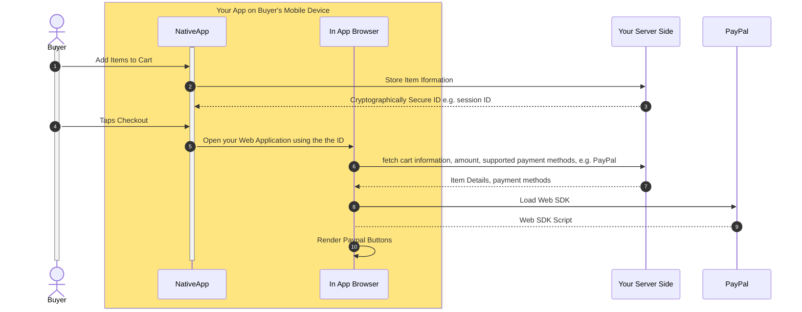

# mobile-app-web-sdk-integration-example

> **Important:** PayPal does not recommend using Webview to integrate PayPal Checkout with Native Mobile App. To deliver the best experience use [PayPal Android SDK](https://developer.paypal.com/docs/checkout/advanced/android/) and [PayPal iOS SDK](https://developer.paypal.com/docs/checkout/advanced/ios/). You can also use [Braintree iOS](https://developer.paypal.com/braintree/docs/guides/client-sdk/setup/ios/v5) and  [Braintree Android](https://developer.paypal.com/braintree/docs/guides/client-sdk/setup/android/v3) SDK.

You may use this guide as a reference to integrate a web Javascript SDK to launch a checkout experience in your mobile application if you cannot use Native SDKs. 

## 1. Prerequisites
1. You have a mobile app which is installed on buyer's mobile device.
2. You host a web based checkout application to render different Payment Options like [PayPal Standard Checkout](https://developer.paypal.com/studio/checkout/standard) or [Card Processing](https://developer.paypal.com/studio/checkout/advanced).
2. Your mobile application has a capability to launch [SFSafariViewController](https://developer.apple.com/documentation/safariservices/sfsafariviewcontroller) or [Android Custom Tabs](https://developer.chrome.com/docs/android/custom-tabs).
3. Your mobile application must have a configured universal link or deep link to properly return users from your web checkout application to your mobile application. Please refer to [Android App Links](https://developer.android.com/training/app-links) and [iOS Universal links](https://developer.apple.com/ios/universal-links/)

## 2. Understand the Payment Flow
Before diving into integration, understand the payment flow:

1. User Action: The user initiates a checkout (e.g., by clicking a "Pay" button on your Native Mobile App).
2. Payment Options: Your app renders your
3. User Action: Buyer Selects one of the Payment options (PayPal) from your web based checkout page and approves the payment on PayPal.com.
4. Confirmation: PayPal returns a success or failure response to your web checkout experience.
5. Hand off to App: Your web checkout web application redirects the buyer back to success screen of your mobile app.

   

## 3. Host your Web Checkout experience
Create a web based checkout application which should serve PayPal [JavaScript SDK](/sdk/js). Your web application must have an entry point (url endpoint) which your mobile app will redirect you.

If your mobile app provides a capability to add different items to a shopping cart and checkout, then you should store the cart information on your server and generate a secure reference identifier of this shoppint cart. You should then pass the reference identifier from your mobile app to your checkout application's URL, when launching it inside  SFSafariViewController or Android Custom Tabs.

> **Important:** Do not pass cart details in URL query parameters. Use a secure REST/GraphQL API calls to store your cart information in your server side store from mobile app and only pass a cryptographically secure identifier like a session id or shopping cart id from mobile application to web application.

Your web application should render the supported payment methods, like PayPal, Venmo, Debit or Credit Card and render the payment methods on the web application's entry page.
Once the buyer clicks one of available payment method, e.g. PayPal, approves the payment, present a success message on your web application along with a return to mobile app button.

> **Important:** Attempting a redirection back to your mobile application without any interaction by the user may be declined by the Chrome / Safari due to transient activation. 

From the success page of your web application you should also notify your backend server that the buyer has approved the payment. This is crucial to avoid losing the status if the buyer taps on the close button of SFSafariViewController or Android Custom Tabs after approving the payment.

Your mobile application should determine if the buyer has approved the session by doing a lookup on the reference identifier once the buyer is redirected back to your Mobile Application. 
